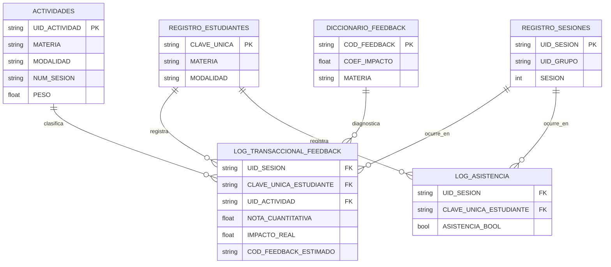

# Arquitectura

## Modelo DRM

- **Dato**: asistencia individual, notas, actividades, sesiones, evidencias.
- **Restricción**: las tablas dimensionales no almacenan métricas agregadas
  ni cálculos — esos viven exclusivamente en `outputs/` (asistencia por
  sesión/estudiante, correlaciones, rankings) o se derivan en tiempo de
  consulta.
- **Meta**: una historia académica auditable por estudiante — cada nota
  final debe poder reconstruirse hasta la fila cruda que la originó.

## Star schema

`CALIFICACIONES_VIRTUAL` / `CALIFICACIONES_PRESENCIAL` (staging) no aparecen
aquí a propósito: son matrices anchas que violan 1NF, existen únicamente
como insumo crudo del ETL, y ninguna consulta analítica debería apuntarles
directamente.

## Por qué dos merges y no uno

El pipeline resuelve `UID_SESION` con un **join explícito contra
`REGISTRO_SESIONES`** — no concatenando `UID_GRUPO + "_" + NUM_SESION` como
texto. La diferencia no es cosmética: al correr el pipeline sobre los datos
reales, ese join expuso que el grupo `IO_ADMIN_30101` tiene sus sesiones
registradas alternando entre dos códigos de grupo (`IO_ADMIN_30101` y
`IO_ADMIN_31101`) en `REGISTRO_SESIONES`. Concatenar texto habría producido
un `UID_SESION` sintácticamente válido pero **inexistente como sesión
real** — el error habría quedado invisible. El join lo convierte en un
hallazgo documentado (`quality_report.md`, sección "Sesiones huérfanas"),
con una fila de respaldo para no perder la calificación mientras se
investiga la causa.

Mismo principio para `UID_ACTIVIDAD` (Merge 1 contra `ACTIVIDADES`): el
prefijo de modalidad no es consistente entre materias (`IOP_` para
Investigación de Operaciones presencial, pero `AL_` sin sufijo para Álgebra
Lineal presencial), así que reconstruir el identificador por concatenación
es frágil por diseño. Cualquier consulta a una dimensión real, nunca texto.

## Motor de estimación DRM: bandas fijas, no percentiles

`COD_FEEDBACK_ESTIMADO` clasifica cada nota en una banda fija de la escala
0.0–5.0 (no percentiles de la distribución observada — una banda fija no
cambia de significado de un corte a otro) y cruza contra
`DICCIONARIO_FEEDBACK` filtrando por materia:

| Nota | Banda | Candidatos |
|---|---|---|
| (−∞, 1.0] | `NULO_PLAG` | `GEN_NULO\|GEN_PLAG` |
| (1.0, 2.0] | `DEFICIENTE` | `COEF_IMPACTO == 0.20` |
| (2.0, 3.0] | `INSUFICIENTE` | `0.40 ≤ COEF_IMPACTO ≤ 0.50` |
| (3.0, 4.0] | `ACEPTABLE` | `0.60 ≤ COEF_IMPACTO ≤ 0.70` |
| (4.0, 4.5] | `SOBRESALIENTE` | `COEF_IMPACTO == 0.80` + `GEN_TARD` |
| (4.5, 5.0] | `EXCELENTE` | `GEN_OK` |

Los límites originales (`1.1–2.0`, `2.1–3.0`...) dejaban sin definir el
intervalo `(1.0, 1.1)`; se usan bandas contiguas `(límite_anterior,
límite_actual]` para cerrar ese hueco sin alterar la intención.

**Es una lista de candidatos, no un diagnóstico.** Varios códigos de una
materia comparten `COEF_IMPACTO`, así que una banda puede estimar más de
uno. `COD_FEEDBACK` (definitivo) queda vacío a propósito: elegir entre los
candidatos sigue siendo criterio del docente.

**Cobertura desigual del diccionario**: 64 de 5,476 filas (1.2%) no
encuentran ningún código estimable porque su materia no tiene un código en
esa banda de `COEF_IMPACTO` — `AM` y `ME` no tienen código
Metodológico/Procedimental (banda `ACEPTABLE`); `EST` y `RC` no tienen
código Estructural (banda `DEFICIENTE`). El pipeline no inventa un código
para rellenar el hueco; lo reporta (`SIN_CODIGO_DISPONIBLE` +
`quality_report.md`) y deja la decisión de ampliar `DICCIONARIO_FEEDBACK`
al docente.

## Asistencia: por qué la tasa virtual y presencial no son comparables

La corrida más reciente mide asistencia promedio de 67.8% en presencial
contra 15.0% en virtual. Antes de leer esto como "los estudiantes virtuales
no asisten", conviene notar que **la mecánica de registro es distinta por
modalidad** — presencial registra asistencia por sesión de clase física;
virtual depende de otro mecanismo de marcación que puede subregistrar
participación real (por ejemplo, contenido asincrónico que un estudiante sí
consume pero que no genera una marca de "asistencia" en el log). El pipeline
reporta la cifra sin corregirla — no es su rol inferir la causa — pero
`estudiantes_riesgo.csv` incluye la columna `MODALIDAD` explícitamente para
que cualquier lectura posterior tenga ese contexto a la vista y no se trate
como una sola población homogénea.

## Cero redundancia: qué se excluyó a propósito

`LOG_TRANSACCIONAL_FEEDBACK` no persiste `MATERIA` aunque el motor de
estimación la necesita internamente — es derivable vía `UID_ACTIVIDAD →
ACTIVIDADES → MATERIA`, y persistirla sería una columna denormalizada
redundante. Se calcula en memoria durante el pipeline y se descarta antes
de exportar. De la misma forma, la tasa de asistencia por estudiante vive en
un reporte separado (`outputs/tasa_asistencia_estudiante.csv`), no como
columna de `LOG_TRANSACCIONAL_FEEDBACK`: es una métrica agregada por
estudiante, y mezclarla en una tabla cuyo grano es estudiante×actividad
rompería la consistencia del grano (cada fila dejaría de representar una
única transacción verificable).
